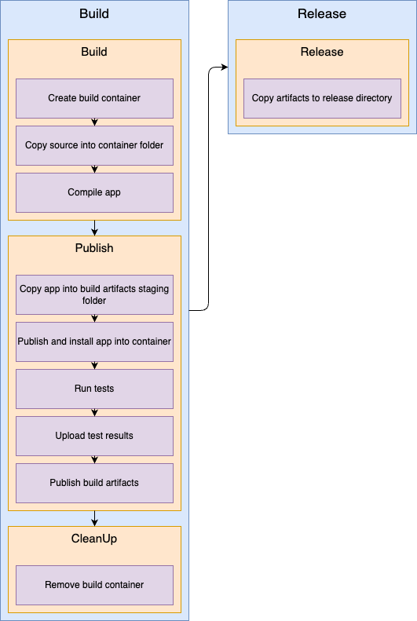

# azdo-pipeline-diagram

Generate a DrawIo diagram of an Azure DevOps pipeline yaml file.

## Pipeline

Works only with the azure-pipelines-expanded.yaml from the execution log zip file.

The pipeline must have stages, jobs, steps.

Edit the generated diagram with a DrawIo extension or website. 

## Known issues

- Not supported:
    - Job strategy
    - Job without `job` like deployment, 
    - Task without `task:` like checkout, script, bash, ...
    - ...

## Sample 
Only for illustration purpose
- Source: [sample-pipeline.yaml](./samples/sample-pipeline.yaml)
- Generated diagram: [sample-pipeline.yaml.drawio](./samples/sample-pipeline.yaml.drawio)

